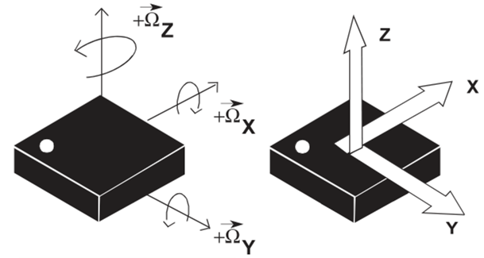

# Charge Robotics IMU Challenge

## Overview

In this directory is `imu.csv`, a data capture from an IMU. A video of the IMU during this data capture [is here.](https://www.youtube.com/watch?v=KmQHklc1Eyk) The data capture contains readings from two sensors:

- An accelerometer, which measures linear acceleration in meters/sec^2
- A gyroscope, which measures angular velocity in radians/sec

At t=0, the IMU is at rest, sitting face-up on a table with the positive z axis pointing towards the sky. The force due to gravity is pointing approximately along the -z axis.

The columns of the CSV file are as follows:

| Column | Description |
| --------- | --------- |
| `time`    | Time in seconds since start of data capture |
| `accel_x` | Accelerometer x-axis (m/s^2) |
| `accel_y` | Accelerometer y-axis (m/s^2) |
| `accel_z` | Accelerometer z-axis (m/s^2) |
| `gyro_x`  | Gyroscope x-axis (rad/s) |
| `gyro_y`  | Gyroscope y-axis (rad/s) |
| `gyro_z`  | Gyroscope z-axis (rad/s) |

## Tasks

Using the provided data capture, please complete the following tasks:

1. Estimate the orientation of the IMU over time using only data from the accelerometer.

2. Estimate the orientation of the IMU over time using only data from the gyroscope.

3. Estimate the orientation of the IMU over time by combining data from both the accelerometer and gyroscope.

4. Visualize your estimates of the IMU's 3D orientation. You can do this however you like: your favorite graphics library, something browser based, etc.

5. Write a short explanation of your solution, talking about the choices you made along the way. The write-up should include three separate commands that we can run to visualize your estimates from steps 1, 2, and 3.

6. **Please commit your work and writeup to a private repository on Github**, and share the repository with Github users `crmaxj` and `crbanks`.

## Evaluation

You will be evaluated on the quality of your approach and implementation. You can implement your solution in whatever language(s) you like, however *please provide instructions so that we can run it*.

We will also be evaluating:
- Algorithm selection, implementation, and efficiency
- Software organization
- Coding style and readability

It’s OK if your solution isn’t perfect, but please tell us about any known limitations of your approach.

## Questions

Please feel free to reach out to your interviewer with any questions about the challenge.
